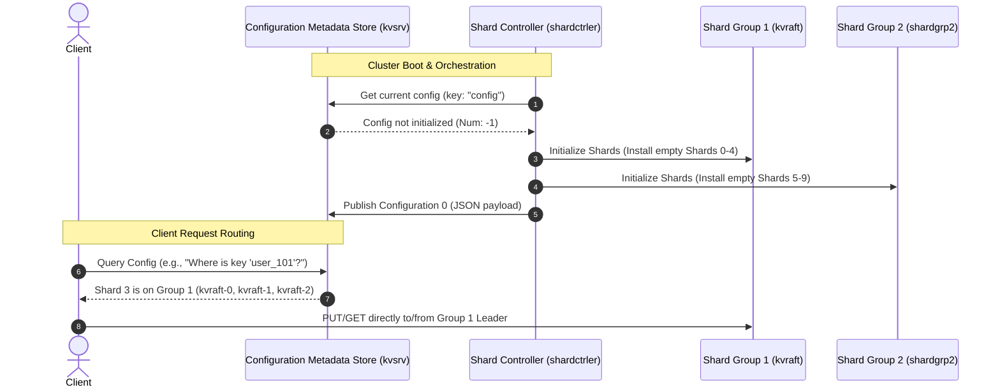

# DKV Orchestration & Fault Tolerance Guide

This document describes the orchestration flow between the Shard Controller and the Configuration Metadata Store, and outlines the fault tolerance deployment guidelines for production.

---

## 1. System Orchestration & Communication Flow

The **Shard Controller** and the **Configuration Metadata Store** cooperate to orchestrate your distributed key-value store.

### Configuration Metadata Store (`kvsrv`)
The metadata store is the **global registry** and single source of truth for the cluster layout.
* **Role**: It is a versioned, replicated key-value state machine that stores the global configuration state.
* **Key Content**: The primary key it maintains is `"config"`, which holds a serialized JSON array representing the active configuration:
  * **`Num`**: The current configuration version number (incremented with every migration/group change).
  * **`Shards`**: An array mapping each shard (e.g., Shard `0` to `9`) to a replica group GID (Group ID).
  * **`Groups`**: A map linking each GID to its server endpoints (e.g., `1 -> [kvraft-0, kvraft-1, kvraft-2]`).
* **Concurrency Protection**: It uses version-checked `Put` requests (optimistic concurrency control) to prevent concurrent administrative scripts or multiple controllers from corrupting configuration records.

### Shard Controller (`shardctrler`)
The Shard Controller is the **administrative engine** of the system. It monitors and rebalances the cluster.
* **Initial Setup**: On startup, it checks the metadata store. If no configuration is present, it distributes the total pool of shards (`NShards`, default `10`) evenly across the available groups.
* **Shard Rebalancing**: When a new replica group is added (or an existing group fails), the controller automatically re-assigns shards to balance the load evenly.
* **Safe Migration Orchestration**: When a shard is moved from Group A to Group B, the Shard Controller coordinates a multi-phase commit:
  1. **Freeze**: Instructs Group A to freeze the target shard (stops accepting new writes).
  2. **Fetch**: Reads the frozen key-value data directly from Group A.
  3. **Install**: Transfers and installs the state data into Group B.
  4. **Delete**: Instructs Group A to delete the old shard data.
  5. **Publish**: Writes the new `ShardConfig` version back to the **Metadata Store** so clients discover the new routing.

---

## 2. Fault Tolerance Deployment Guide

Because the system relies on the **Raft Consensus Protocol**, it requires a **strict majority (quorum)** to operate:

$$\text{Total Nodes} = 2F + 1$$

*(Where $F$ is the number of failures you want to tolerate).*

### Layer-by-Layer Fault Tolerance Guide

| Service Layer | Current Setup | Recommended for Production | Failure Tolerance ($F$) | Rationale |
| :--- | :--- | :--- | :---: | :--- |
| **Configuration Metadata Store (`kvsrv`)** | 1 instance | **3 or 5 instances** | **1** or **2** | Currently, this is a single point of failure (SPOF). However, because `KVServer` is written as a state machine (`DoOp`), you can run it on top of a Raft group. Running **3** instances allows the metadata configuration to survive 1 node crash. |
| **Shard Controller (`shardctrler`)** | 1 instance | **2 or 3 instances** | **1** or **2** | The controller is stateless and uses optimistic version locking on `kvsrv`. You can run multiple instances behind a load balancer; if one crashes, others seamlessly take over. |
| **Shard Groups (`kvraft` & `shardgrp2`)** | 3 instances per group | **3 or 5 instances** per group | **1** or **2** | Each shard group runs Raft internally. Running **3** instances per group allows that group to tolerate 1 follower/leader crash without stopping read/write client traffic. |

### Key Takeaways for Production Deployment:
1. **Never run even numbers of consensus nodes**: A 4-node cluster can still only tolerate 1 failure (since 3 nodes are needed for a quorum). Therefore, always run **3** or **5** nodes for stateful components.
2. **Independent Shard Failure**: In this architecture, if Shard Group 1 loses quorum (e.g., 2 out of 3 nodes crash), only the keys mapped to Shard Group 1 become unavailable. Shard Group 2 continues to serve client operations normally.
