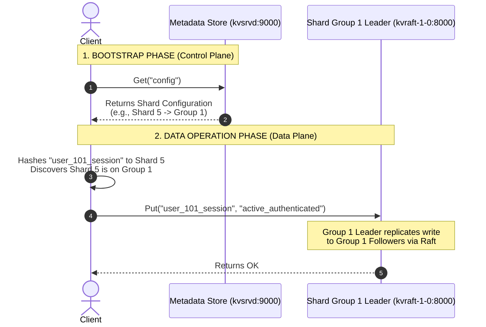

# DKV Architecture: Request Lifecycle and Network Security

This document outlines the end-to-end request lifecycle of the Distributed Key-Value Store (DKV) deployed on GKE, highlighting the separation of concerns between the **Control Plane** (metadata routing) and the **Data Plane** (replicated storage), as well as the network security posture of the cluster.

---

## 1. DKV Request Lifecycle & Routing Path

The DKV client uses a two-phase architecture to perform read/write operations. This ensures that the metadata store is kept out of the critical path for user data operations, allowing the database to scale horizontally.

### Phase 1: Bootstrap & Configuration Fetch (Control Plane)
Before performing any reads or writes, the client must understand the topology of the cluster:
1.  The client sends an initial query to the **Metadata Store** (`metadata-store-service:9000`) requesting the `"config"` key.
2.  The Metadata Store returns the current `ShardConfig` containing:
    *   The total number of shards.
    *   The mapping of shards to Shard Groups (GIDs).
    *   The list of active replica addresses for each Shard Group.
3.  The client caches this configuration locally in memory.

### Phase 2: Data Operation (Data Plane)
When a client executes an operation like `PUT "mykey" "myval"`:
1.  **Shard Hashing (Local)**: The client hashes the key `"mykey"` using a deterministic algorithm (`Key2Shard(key)`) to find its shard index (e.g., Shard 5).
2.  **Group Discovery (Local)**: The client checks its cached configuration to see which group is responsible for Shard 5 (e.g., Shard Group 1 / GID 1).
3.  **Direct Request Routing**: The client connects **directly** to the replica addresses for Shard Group 1 (e.g., `kvraft-1-0.kvraft-1-service:8000`) and sends the `Put` request.
4.  **Consensus & Reply**: The active leader of the Shard Group receives the write, replicates it to its followers via the **Raft** protocol, commits the write to its persistent SSD volume, and returns `OK` to the client.



---

## 2. GKE Network Security Posture

To achieve production-grade security, **zero database services are publicly exposed to the internet**. 

### ClusterIP Isolation
All Kubernetes services in the `dkv` namespace are configured as **`ClusterIP`** services. 
*   **Internal Only**: They are only resolvable and reachable from within the GKE cluster network.
*   **Security Benefits**:
    *   **Zero Public Surface Area**: Port-scanners and malicious actors on the public internet cannot find, scan, or attempt brute-force connections on your database.
    *   **Cost Efficiency**: Prevents Google Cloud from provisioning costly external Load Balancers (which charge hourly idle fees).

### Service Accessibility Directory

| Service Name | Service Type | Internal DNS Address | Publicly Accessible? | Host Machine Development Connection |
| :--- | :---: | :--- | :---: | :--- |
| **`metadata-store-service`** | `ClusterIP` | `metadata-store-service.dkv.svc.cluster.local:9000` | ❌ **No** | `kubectl port-forward -n dkv svc/metadata-store-service 9000:9000` |
| **`shardctrlr-service`** | `ClusterIP` | `shardctrlr-service.dkv.svc.cluster.local:9100` | ❌ **No** | *Not needed (Metrics only)* |
| **`kvraft-1-service`** | `ClusterIP` | `kvraft-1-service.dkv.svc.cluster.local:8000` | ❌ **No** | *Securely accessed internally by pods* |
| **`kvraft-2-service`** | `ClusterIP` | `kvraft-2-service.dkv.svc.cluster.local:8010` | ❌ **No** | *Securely accessed internally by pods* |

---

## 3. Secure Development & Testing via Port-Forwarding

To run local test clients (such as `sample.py`) on your host machine while maintaining this strict security posture, utilize **secure port-forwarding tunnels**:

```bash
# Open a secure, encrypted tunnel from your host to the Metadata Store
kubectl port-forward -n dkv svc/metadata-store-service 9000:9000 --address 0.0.0.0
```

1.  This command uses your authenticated `gcloud` session to create a secure tunnel.
2.  Your local script connects to `localhost:9000`.
3.  Kubernetes encrypts and forwards the traffic directly to `metadata-store-0` in GKE.
4.  This allows full development capability without exposing any cloud ports to the public web!
