# GCP Deployment & High Availability Plan: Distributed Key-Value Store (DKV)

This document provides a production-grade, highly available, and fault-tolerant deployment plan for the **Distributed Key-Value Store (DKV)** on Google Cloud Platform (GCP). It outlines how to translate the local, containerized Docker Compose architecture into a resilient, enterprise-ready cloud topology distributed across multiple regions and zones.

---

## 1. Executive Summary & Design Philosophy

The Distributed Key-Value Store is built on the **Raft Consensus Protocol**, which guarantees safety and linearizability but requires a **strict majority (quorum)** to progress:

$$\text{Quorum} = \lfloor \frac{N}{2} \rfloor + 1$$

To achieve a production-grade, fault-tolerant deployment on GCP, we must ensure that no single infrastructure failure (node, rack, power domain, or entire availability zone) can break this quorum. 

### Core Deployment Goals:
1. **Zone-Level Fault Tolerance (Zero Downtime / Zero Data Loss)**: The system must tolerate the complete loss of any single GCP availability zone (e.g., `us-central1-a` goes offline) without service interruption or data corruption.
2. **Low-Latency Consensus**: Because Raft requires a round-trip write replication to a majority of peers before committing a transaction, we must deploy consensus groups within a **single region across multiple zones** (cross-zone latency is typically < 2ms) rather than across regions (cross-region latency is typically 20–100ms).
3. **Stable Network Identities**: Raft nodes communicate using a fixed list of peers (e.g., `kvraft-0`, `kvraft-1`, `kvraft-2`). The infrastructure must guarantee that if a node crashes and rescheduled, it retains its storage (disk) and network identity (IP/DNS).

---

## 2. Target GCP System Topology

The following architecture diagram represents a **highly available regional deployment** on GCP using **Google Kubernetes Engine (GKE)**. 

The consensus nodes for each Shard Group are distributed across three distinct availability zones (`us-central1-a`, `us-central1-b`, and `us-central1-c`) to guarantee zone-level fault tolerance.

```mermaid
flowchart TB
    subgraph GCP ["Google Cloud Platform - Region: us-central1"]
        subgraph VPC ["Custom VPC (dkv-vpc)"]
            
            subgraph ZoneA ["Zone: us-central1-a"]
                direction TB
                subgraph NodeA ["GKE Node Group A"]
                    K0["dkv-kvraft-0 (Group 1, Peer 0)"]
                    S0["dkv-shardgrp2-0 (Group 2, Peer 0)"]
                    MC0["dkv-kvsrv-0 (Metadata, Peer 0)"]
                end
                PD_K0[("Zonal PD (SSD)
                /var/lib/raft")] <--> K0
                PD_S0[("Zonal PD (SSD)
                /var/lib/raft")] <--> S0
            end

            subgraph ZoneB ["Zone: us-central1-b"]
                direction TB
                subgraph NodeB ["GKE Node Group B"]
                    K1["dkv-kvraft-1 (Group 1, Peer 1)"]
                    S1["dkv-shardgrp2-1 (Group 2, Peer 1)"]
                    MC1["dkv-kvsrv-1 (Metadata, Peer 1)"]
                end
                PD_K1[("Zonal PD (SSD)
                /var/lib/raft")] <--> K1
                PD_S1[("Zonal PD (SSD)
                /var/lib/raft")] <--> S1
            end

            subgraph ZoneC ["Zone: us-central1-c"]
                direction TB
                subgraph NodeC ["GKE Node Group C"]
                    K2["dkv-kvraft-2 (Group 1, Peer 2)"]
                    S2["dkv-shardgrp2-2 (Group 2, Peer 2)"]
                    MC2["dkv-kvsrv-2 (Metadata, Peer 2)"]
                end
                PD_K2[("Zonal PD (SSD)
                /var/lib/raft")] <--> K2
                PD_S2[("Zonal PD (SSD)
                /var/lib/raft")] <--> S2
            end

            subgraph ControlPlane ["Stateless Control Services"]
                CTR1["dkv-shardctrler-0"]
                CTR2["dkv-shardctrler-1"]
            end

            subgraph Observability ["Observability Stack"]
                PROM["Managed Prometheus"]
                GRAF["Grafana Pod"]
            end
            
            ILB["Internal Load Balancer
            (dkv-ctrler-ilb:9100)"] --> CTR1 & CTR2
        end
    end

    subgraph ClientSpace ["Client Environment"]
        ClientVM["Client Application / CLI VM"]
    end

    %% Network interactions
    ClientVM -.->|1. Query Topology| MC0 & MC1 & MC2
    ClientVM ===>|2. Put/Get directly to Leader| K0
    ClientVM ===>|2. Put/Get directly to Leader| S1
    
    CTR1 & CTR2 ===>|Orchestrate Shards| MC0 & MC1 & MC2
    CTR1 & CTR2 -.->|Monitor/Migrate| K0 & K1 & K2
    CTR1 & CTR2 -.->|Monitor/Migrate| S0 & S1 & S2

    PROM -.->|Scrape Metrics| K0 & K1 & K2
    PROM -.->|Scrape Metrics| S0 & S1 & S2
    PROM -.->|Scrape Metrics| MC0
    GRAF ===>|Query Metrics| PROM
```



---

## 3. Recommended Compute Layer: Google Kubernetes Engine (GKE)

Deploying DKV on **GKE Autopilot or Standard** is the highly recommended path. GKE natively solves the hard problems of stateful distributed systems through **StatefulSets**, **Headless Services**, and **Pod Topology Spread Constraints**.

### 3.1 GKE Resource Orchestration

We will map the containerized services into Kubernetes resources as follows:

| Service | Kubernetes Resource Type | Replicas | HA Strategy | Storage Requirements |
| :--- | :--- | :---: | :--- | :--- |
| **Configuration Metadata Store (`kvsrvd`)** | `StatefulSet` (or `Deployment`) | 3 | Run 3-node replicated Raft metadata group across 3 zones. | 10GiB Zonal Persistent Disk (`pd-ssd`) per pod |
| **Shard Group 1 (`kvraftd` - GID 1)** | `StatefulSet` | 3 | Pod Anti-Affinity: 1 pod per zone (a, b, c). | 50GiB+ Zonal Persistent Disk (`pd-ssd`) per pod |
| **Shard Group 2 (`shardgrp2d` - GID 2)** | `StatefulSet` | 3 | Pod Anti-Affinity: 1 pod per zone (a, b, c). | 50GiB+ Zonal Persistent Disk (`pd-ssd`) per pod |
| **Shard Controller (`shardctrlrd`)** | `Deployment` | 2 | Stateless. Run behind an Internal Load Balancer across multiple zones. | Ephemeral |
| **Observability (Prometheus/Grafana)** | `Deployment` / Managed | 1 | Standard cloud monitoring or self-hosted deployment. | Zonal Persistent Disk (`pd-balanced`) |

### 3.2 Stable Identity & DNS Resolution (Headless Services)
Raft peers must be configured with permanent network addresses. In GKE, we create a **Headless Service** (with `clusterIP: None`) for each `StatefulSet`. This enables Kubernetes CoreDNS to generate predictable, stable DNS A-records for each individual Pod.

For example, a headless service named `kvraft-service` in the namespace `dkv` will expose the following addresses:
*   Node 0: `kvraft-0.kvraft-service.dkv.svc.cluster.local:8000`
*   Node 1: `kvraft-1.kvraft-service.dkv.svc.cluster.local:8000`
*   Node 2: `kvraft-2.kvraft-service.dkv.svc.cluster.local:8000`

Even if the Pod for `kvraft-1` crashes and is rescheduled on a different physical Kubernetes node, it will boot up with the **same DNS name** and automatically re-attach to the **same Persistent Disk**, allowing it to rejoin the Raft consensus seamlessly.

### 3.3 Pod Anti-Affinity (Zonal Isolation)
To guarantee that a single zone outage cannot take down more than one node of a Raft group, we must enforce a `podAntiAffinity` rule in the `StatefulSet` manifest. This instructs the Kubernetes scheduler to distribute pods across different zones.

#### Example StatefulSet Spec for `kvraft`:
```yaml
apiVersion: apps/v1
kind: StatefulSet
metadata:
  name: dkv-kvraft
  namespace: dkv
spec:
  serviceName: kvraft-service
  replicas: 3
  selector:
    matchLabels:
      app: dkv-kvraft
  template:
    metadata:
      labels:
        app: dkv-kvraft
    spec:
      affinity:
        podAntiAffinity:
          requiredDuringSchedulingIgnoredDuringExecution:
            - labelSelector:
                matchExpressions:
                  - key: app
                    operator: In
                    values:
                      - dkv-kvraft
              topologyKey: topology.kubernetes.io/zone
      containers:
        - name: kvraftd
          image: gcr.io/my-gcp-project/dkv-kvraft:latest
          command:
            - "server"
            - "--me"
            - "$(POD_INDEX)" # Extracted via Downward API or script
            - "--peers"
            - "dkv-kvraft-0.kvraft-service.dkv.svc.cluster.local:8000,dkv-kvraft-1.kvraft-service.dkv.svc.cluster.local:8000,dkv-kvraft-2.kvraft-service.dkv.svc.cluster.local:8000"
            - "--gid"
            - "1"
            - "--persist-dir"
            - "/var/lib/raft"
            - "--metrics-addr"
            - ":9091"
          ports:
            - containerPort: 8000
              name: raft
            - containerPort: 9091
              name: metrics
          volumeMounts:
            - name: raft-data
              mountPath: /var/lib/raft
  volumeClaimTemplates:
    - metadata:
        name: raft-data
      spec:
        accessModes: [ "ReadWriteOnce" ]
        storageClassName: premium-rwo # Maps to GCP pd-ssd (SSD Persistent Disk)
        resources:
          requests:
            storage: 50Gi
```

---

## 4. Alternative Compute Layer: Google Compute Engine (GCE) VMs

For deployments that require bypassing container overhead or aligning with legacy VM infrastructures, the cluster can be deployed on **GCE Virtual Machines** using **Stateful Managed Instance Groups (MIGs)**.

### 4.1 Topology Setup
1. **VM Provisioning**: Create 3 virtual machines per Shard Group (e.g., `dkv-kvraft-0`, `dkv-kvraft-1`, `dkv-kvraft-2`) using a `e2-standard-2` machine type (2 vCPUs, 8 GB RAM) or higher.
2. **Zonal Spreading**:
   - `dkv-kvraft-0` $\rightarrow$ `us-central1-a`
   - `dkv-kvraft-1` $\rightarrow$ `us-central1-b`
   - `dkv-kvraft-2` $\rightarrow$ `us-central1-c`
3. **Static Internal IPs**: Assign a static internal IP to each VM within the GCP VPC subnet, or configure internal DNS names via Cloud DNS. Peer addresses in the application config will use these static IPs or DNS hostnames (e.g., `10.128.0.10:8000,10.128.1.10:8000,10.128.2.10:8000`).

### 4.2 Storage Persistence
- Attach a **Zonal SSD Persistent Disk (`pd-ssd`)** to each VM. 
- In a GCE Managed Instance Group, configure **Stateful Disks**. This guarantees that if a VM instance is recreated, GCP automatically detaches the disk from the failed VM and re-attaches it to the new instance, keeping all Raft logs intact.

### 4.3 Daemon Management
Use a **systemd service** on each VM to manage the lifecycle of the Go binary.

```ini
# /etc/systemd/system/dkv-kvraft.service
[Unit]
Description=DKV Shard Group Replica Node
After=network.target

[Service]
Type=simple
User=dkv
WorkingDirectory=/var/lib/raft
ExecStart=/usr/local/bin/kvraftd \
  --me 0 \
  --peers dkv-kvraft-0.c.my-project.internal:8000,dkv-kvraft-1.c.my-project.internal:8000,dkv-kvraft-2.c.my-project.internal:8000 \
  --gid 1 \
  --persist-dir /var/lib/raft \
  --metrics-addr :9091
Restart=always
RestartSec=5
LimitNOFILE=65536

[Install]
WantedBy=multi-user.target
```

---

## 5. Networking & Security (VPC Architecture)

A secure, isolated network is critical for preventing unauthorized access to the database ports and protecting inter-node consensus traffic.

```
                  +-------------------------------------------+
                  |               GCP VPC                     |
                  |                                           |
                  |  +-------------------------------------+  |
                  |  |         Private Subnet              |  |
                  |  |  (10.128.0.0/20, no public IPs)      |  |
                  |  |                                     |  |
                  |  |  +---------------+                  |  |
                  |  |  |   kvsrvd      |                  |  |
                  |  |  |   (Metadata)  |                  |  |
                  |  |  +-------^-------+                  |  |
                  |  |          | (port 9000)              |  |
                  |  |  +-------+-------+                  |  |
                  |  |  | shardctrler   |<--+              |  |
                  |  |  +-------^-------+   |              |  |
                  |  |          |           |              |  |
                  |  |  +-------+-------+   | (port 9100)  |  |
                  |  |  |  dkv-client   |   |              |  |
                  |  |  |  (CLI / App)  |---+              |  |
                  |  |  +-------+-------+                  |  |
                  |  |          | (ports 8000/8010)        |  |
                  |  |  +-------v-------+                  |  |
                  |  |  |  kvraftd/     |                  |  |
                  |  |  |  shardgroups  |                  |  |
                  |  |  +---------------+                  |  |
                  |  +-------------------------------------+  |
                  +-------------------------------------------+
```

### 5.1 Subnet Architecture
- **Private Subnets**: Deploy the entire DKV cluster in a custom VPC with **Private Google Access** enabled. None of the DKV database instances should have public IP addresses.
- **Cloud NAT**: Deploy a **Cloud NAT Gateway** in the region. This allows GKE nodes or GCE VMs to safely download OS updates, Docker base images, or dependency packages from the internet without exposing them to incoming internet traffic.
- **Bastion Host (Optional)**: For administrative CLI access, deploy a small VM (e.g., `f1-micro`) in a public subnet, restricted by Identity-Aware Proxy (IAP) SSH. Administrators tunnel through IAP to run `dkv-client` commands.

### 5.2 Firewall Rules & Port Matrix
We configure GCP Firewall Rules to enforce the principle of least privilege:

| Port | Protocol | Source Range | Target Tags / Service Accounts | Purpose |
| :--- | :---: | :--- | :--- | :--- |
| **8000** | TCP | VPC Subnet (`10.128.0.0/20`) | `tag:dkv-kvraft` | Shard Group 1: Raft consensus & client requests |
| **8010** | TCP | VPC Subnet (`10.128.0.0/20`) | `tag:dkv-shardgrp2` | Shard Group 2: Raft consensus & client requests |
| **9000** | TCP | VPC Subnet (`10.128.0.0/20`) | `tag:dkv-kvsrv` | Configuration Metadata Store (`kvsrv`) |
| **9100** | TCP | VPC Subnet (`10.128.0.0/20`) | `tag:dkv-shardctrler` | Shard Controller RPC endpoint |
| **9091** | TCP | Prometheus Subnet / Pods | All DKV nodes | Prometheus scraping for application metrics |

---

## 6. Fault Tolerance & Failure Mode Analysis

The core of our GCP architecture is its mathematical resilience to failures. Below is an analysis of how this regional, cross-zonal deployment handles various disaster scenarios.

### 6.1 Failure Scenarios

| Failure Event | Impact on Shard Group 1 (GID 1) | Impact on Shard Group 2 (GID 2) | Impact on Metadata (`kvsrv`) | Overall System Status |
| :--- | :--- | :--- | :--- | :--- |
| **Single Node Crash** (e.g. `kvraft-0`) | **None**. Quorum is maintained (2/3 nodes active). Remaining nodes elect a new leader if needed. | **None**. Operating normally. | **None**. Operating normally. | **Degraded but fully operational**. GKE automatically restarts the crashed pod and re-attaches the zonal PD. |
| **Complete Zone Outage** (e.g., `us-central1-a` goes dark) | **None**. `kvraft-1` (Zone B) and `kvraft-2` (Zone C) maintain quorum. Operations continue. | **None**. `shardgrp2-1` and `shardgrp2-2` maintain quorum. Operations continue. | **None**. Metadata Raft group maintains quorum (2/3 nodes active in Zones B and C). | **Fully operational**. Write latency might slightly shift as consensus now traverses cross-zone boundaries, but no downtime is observed. |
| **Double Zone Outage** (e.g., `us-central1-a` & `us-central1-b` go dark) | **Read/Write Blocked**. Only 1/3 nodes active; quorum is lost. | **Read/Write Blocked**. Only 1/3 nodes active; quorum is lost. | **Read/Write Blocked**. Quorum lost. | **Offline**. The system halts to prevent split-brain and data inconsistency. Once one zone recovers, the system automatically resumes service. |
| **Individual Shard Group Quorum Loss** (e.g., 2 nodes of GID 1 crash) | **GID 1 Offline**. Keys mapped to GID 1 cannot be read/written. | **Fully Operational**. GID 2 continues serving its keys normally. | **Fully Operational**. Shard Controller and metadata store remain online. | **Partially Degraded**. Only the subset of keys residing on GID 1 is unavailable. The rest of the keys are fully operational. |

---

## 7. Cloud Observability & Monitoring

A distributed Raft system requires robust telemetry to detect split-brain, slow disk writes, or replication lag.

### 7.1 Prometheus Metrics Integration
Every DKV binary is compiled with a `/metrics` HTTP server on port `9091`. On GCP, we can leverage **Google Cloud Managed Service for Prometheus (GMP)** to automatically scrape these endpoints without managing a heavyweight Prometheus server.

#### Key Metrics to Monitor & Alert On:
- `raft_term`: Rapidly changing terms indicate leader instability or network partitions.
- `raft_is_leader`: Ensures there is exactly 1 leader per shard group. If zero leaders exist, write operations will fail/timeout.
- `shard_migration_duration_seconds`: Monitors the time taken by the Shard Controller to migrate a shard from one group to another (freezing, fetching, installing, deleting). High durations indicate network saturation or oversized shards.
- `rpc_errors_total`: Monitors inter-node connection drops.

### 7.2 Cloud Logging
Run GKE Fluentbit or GCE Logging Agent to stream standard output/error to **Google Cloud Logging (Stackdriver)**. 
- Create log-based alerts for critical error keywords, such as:
  - `lost consensus`
  - `migration failed`
  - `failed to commit`

---

## 8. Step-by-Step Production Rollout Guide

Follow these steps to deploy the DKV cluster on GCP from scratch.

### Step 1: Packaging & Registry
Build your Go binaries into Docker images using the multi-stage Dockerfile and push them to **GCP Artifact Registry**:

```bash
# Set environment variables
export PROJECT_ID="your-gcp-project-id"
export REGION="us-central1"
export REPO_NAME="dkv-repo"

# Create Artifact Registry
gcloud artifacts repositories create $REPO_NAME \
    --repository-format=docker \
    --location=$REGION \
    --description="DKV Docker Registry"

# Build and Push Shard Group image (kvraftd)
docker build -t $REGION-docker.pkg.dev/$PROJECT_ID/$REPO_NAME/kvraftd:latest \
    --build-arg BUILD_TARGET=kvraftd \
    -f DistributedKeyValueStore/deployments/docker/Dockerfile DistributedKeyValueStore

docker push $REGION-docker.pkg.dev/$PROJECT_ID/$REPO_NAME/kvraftd:latest

# Build and Push Metadata Store image (kvsrvd)
docker build -t $REGION-docker.pkg.dev/$PROJECT_ID/$REPO_NAME/kvsrvd:latest \
    --build-arg BUILD_TARGET=kvsrvd \
    -f DistributedKeyValueStore/deployments/docker/Dockerfile DistributedKeyValueStore

docker push $REGION-docker.pkg.dev/$PROJECT_ID/$REPO_NAME/kvsrvd:latest

# Build and Push Shard Controller image (shardctrlrd)
docker build -t $REGION-docker.pkg.dev/$PROJECT_ID/$REPO_NAME/shardctrlrd:latest \
    --build-arg BUILD_TARGET=shardctrlrd \
    -f DistributedKeyValueStore/deployments/docker/Dockerfile DistributedKeyValueStore

docker push $REGION-docker.pkg.dev/$PROJECT_ID/$REPO_NAME/shardctrlrd:latest
```

### Step 2: Provision Infrastructure (Terraform)
Write a Terraform configuration to provision:
1. A VPC with a private subnet in `us-central1`.
2. A GKE cluster with nodes spread across `us-central1-a`, `us-central1-b`, and `us-central1-c`.
3. Cloud NAT for internet egress.
4. An Internal Load Balancer for the Shard Controller.

### Step 3: Deploy to Kubernetes
Apply the Kubernetes manifests (or Helm chart) in the following logical order:
1. **Namespaces & ConfigMaps**: Define the namespace `dkv` and any shared environment variables.
2. **Configuration Metadata Store (`kvsrvd`)**: Deploy the StatefulSet and its Headless Service.
3. **Shard Group StatefulSets**:
   - Deploy `dkv-kvraft` (GID 1) StatefulSet (3 replicas).
   - Deploy `dkv-shardgrp2` (GID 2) StatefulSet (3 replicas).
4. **Shard Controller (`shardctrlrd`)**: Deploy the stateless controller Deployment. Point its `--kvsrv-addr` to `kvsrv-service.dkv.svc.cluster.local:9000` and its `--groups` flag to the stable headless DNS records:
   ```bash
   --groups "1=dkv-kvraft-0.kvraft-service.dkv.svc.cluster.local:8000,dkv-kvraft-1.kvraft-service.dkv.svc.cluster.local:8000,dkv-kvraft-2.kvraft-service.dkv.svc.cluster.local:8000;2=dkv-shardgrp2-0.shardgrp2-service.dkv.svc.cluster.local:8010,dkv-shardgrp2-1.shardgrp2-service.dkv.svc.cluster.local:8010,dkv-shardgrp2-2.shardgrp2-service.dkv.svc.cluster.local:8010"
   ```

### Step 4: Validate Cluster Health & Chaos Testing
1. **Boot Verification**: Check that the Shard Controller successfully connects to `kvsrv` and initializes the routing configuration (partitioning shards 0-9 across GID 1 and GID 2).
2. **Write/Read Validation**: Exec into a client pod and run the CLI client:
   ```bash
   dkv-client --ctrler-addr kvsrv-service.dkv.svc.cluster.local:9000 put key1 val1
   dkv-client --ctrler-addr kvsrv-service.dkv.svc.cluster.local:9000 get key1
   ```
3. **Zonal Chaos Test**: Simulate a zonal disaster by deleting one of the GKE nodes or cordoning a zone. Verify that the Raft groups remain healthy, elect new leaders, and client requests suffer zero downtime.
