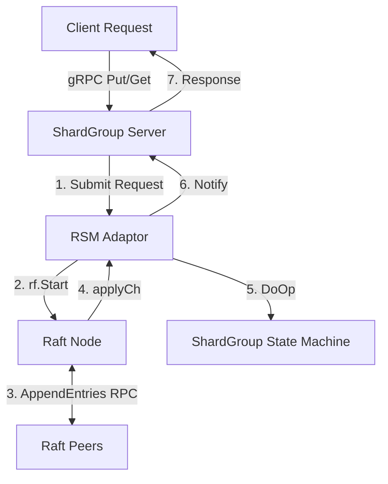

# DKV Consensus & Replicated State Machine (RSM) Guide

This document provides a technical walkthrough of how the **Raft Consensus Engine** and the **Replicated State Machine (RSM)** operate within a sharded database container (specifically `dkv-kvraft-x`).

---

## 1. Raft & RSM Core Concepts

In DKV, each replica group (e.g. Group 1 running in `dkv-kvraft-0`, `1`, `2`) forms a separate stateful cluster. They coordinate state changes using two main design patterns:

### What is Raft?
**Raft** is a consensus algorithm designed to manage a replicated, append-only log of state transitions. It ensures that a cluster of nodes agrees on the exact order of actions (log entries), even in the face of network partitions, node failures, or leader changes.

### What is a Replicated State Machine (RSM)?
An **RSM** is a system design where multiple identical deterministic state machines (in our case, the database engine `shardgrp.ShardGroup`) start in the same initial state, receive the exact same sequence of inputs in the same order, and arrive at the exact same output state.
* **The Bridge:** The `rsm.RSM` struct serves as the adaptor layer. It sits between the networking/server wrapper (`shardgrp.Server`) and the consensus engine (`raft.Raft`).



---

## 2. Anatomy of `dkv-kvraft-x` Container

Each container representing a replica node in a shard group (configured in `docker-compose.yml` under `kvraft-0..2` and `shardgrp2-0..2`) runs the compiled **`kvraftd`** binary.

Inside this container, the following components are initialized and run concurrently:

```
┌─────────────────────────────────────────────────────────────┐
│                   dkv-kvraft-x Container                    │
│                                                             │
│  ┌──────────────────────┐        ┌──────────────────────┐  │
│  │   gRPC RPC Listener  │        │    Disk Persister    │  │
│  │  (port 8000 / 8010)  │        │    (/var/lib/raft)   │  │
│  └──────────┬───────────┘        └──────────┬───────────┘  │
│             │                               │              │
│  ┌──────────▼───────────┐        ┌──────────▼───────────┐  │
│  │    ShardGroup Server │        │      Raft Node       │  │
│  │ (internal/shardgrp)  │        │   (internal/raft)    │  │
│  └──────────┬───────────┘        └──────────▲───────────┘  │
│             │                               │              │
│             │    ┌─────────────────────┐    │              │
│             └────►    RSM Connector    ├────┘              │
│                  │   (internal/rsm)    │                   │
│                  └─────────────────────┘                   │
└─────────────────────────────────────────────────────────────┘
```

---

## 3. Codebase Responsibilities

Here is the breakdown of which files handle each aspect of the container's lifecycle:

| Component / Layer | Source Files | Primary Responsibilities |
| :--- | :--- | :--- |
| **Container Entry Point** | [`cmd/kvraftd/main.go`](../DistributedKeyValueStore/cmd/kvraftd/main.go) | Parses ports, group IDs, and peer list; instantiates the database engine (`shardgrp.New`), the Raft consensus engine (`raft.Make`), the RSM bridge (`rsm.New`), and starts the TCP server. |
| **Consensus Engine** | [`internal/raft/raft.go`](../DistributedKeyValueStore/internal/raft/raft.go) | Maintains the core persistent states (`currentTerm`, `votedFor`, `log`) and volatile states (`commitIndex`, `lastApplied`). Implements `Start(command)`. |
| **Leader Election** | [`internal/raft/election.go`](../DistributedKeyValueStore/internal/raft/election.go) | Runs the background `ticker()` loop checking for election timeouts, starts candidate elections, and processes inbound `RequestVote` RPC handlers. |
| **Log Replication** | [`internal/raft/replication.go`](../DistributedKeyValueStore/internal/raft/replication.go) | Handles sending and receiving `AppendEntries` RPCs, updating peer next/match indexes, advancing `commitIndex`, and spawning the sequential `applier()` goroutine that drives the `applyCh` channel. |
| **State Bridge (RSM)** | [`internal/rsm/rsm.go`](../DistributedKeyValueStore/internal/rsm/rsm.go) | Exposes `Submit(op)` to block clients until consensus is reached, and runs a background `reader()` loop reading `applyCh` messages, executing them sequentially, and waking blocked clients. |
| **Database Engines** | [`internal/shardgrp/server.go`](../DistributedKeyValueStore/internal/shardgrp/server.go) | Implements client-facing RPC handlers (`Put`/`Get`/`Append`) and processes the actual database state transitions in `DoOp()`. |
| **State Persistence** | [`internal/persist/disk.go`](../DistributedKeyValueStore/internal/persist/disk.go) | Manages binary read/writes to persistent disk volumes, maintaining durability of Raft logs and snapshots. |
| **gRPC Server Layer** | [`internal/transport/grpc.go`](../DistributedKeyValueStore/internal/transport/grpc.go) | Implements gRPC routing to map RPC payloads to execution methods. |

---

## 4. Leader Election Process

Raft nodes operate in one of three roles: **Follower**, **Candidate**, or **Leader**.

### When does Leader Election happen?
1. **Startup:** All nodes boot as Followers with a randomized election timeout between **300ms and 500ms** (configured via `resetElectionTimeout()`).
2. **Leader Heartbeat Failure:** The active Leader must send periodic heartbeat signals (empty `AppendEntries` RPCs) at least every **100ms** (defined in `replicationTicker()`).
3. **Trigger:** If a Follower's election timeout timer expires (`time.Since(rf.lastReset) > rf.electionTimeout`) without receiving a heartbeat or log replication from a valid Leader, the Follower initiates an election.

### How is an election executed?
1. **Transition to Candidate:** The node increments its `currentTerm`, votes for itself (`rf.votedFor = rf.me`), writes this state to disk, and resets its election timer.
2. **Request Votes:** The Candidate sends parallel `RequestVote` RPCs (defined in `election.go`) containing its `currentTerm`, its ID, and its last log's index and term.
3. **Vote Validation:** Receivers only grant votes if:
   * The candidate's term is greater than or equal to their own.
   * They haven't voted for another candidate in this term.
   * The candidate’s log is at least as up-to-date as theirs (evaluated by comparing `LastLogTerm`, then `LastLogIndex`).
4. **Acquiring Leadership:** If a Candidate receives votes from a **strict majority** (e.g. 2 out of 3 peers), it transitions to Leader (`role = core.Leader`). It immediately initializes `nextIndex` and `matchIndex` arrays for all peers, and starts the `replicationTicker` to broadcast heartbeats and assert authority.

---

## 5. How the RSM Operates

The Replicated State Machine ensures client operations are executed identically on every node:

1. **Submission:** When a command is submitted via `rsm.Submit(op)`, it does **not** modify the local key-value store. It is wrapped in a `core.Op` with a unique ID (nonce) and passed to Raft via `rf.Start()`.
2. **Replication:** Raft writes the command to its local log and forwards it to followers via `AppendEntries` RPCs.
3. **Commitment:** Once a majority of nodes have appended the log entry, the Leader increments `commitIndex`.
4. **Application:** The Leader's Raft `applier()` goroutine detects `commitIndex > lastApplied`, packs the command into a `core.ApplyMsg`, and pushes it to `applyCh`.
5. **Execution:** The `rsm.reader()` goroutine (which blocks on `applyCh`) pops the command and calls `sm.DoOp(op)`. This is the exact moment the write is committed to the local database memory map (applying linearizable validation like key checks and version increments).
6. **Client Notification:** Finally, the `reader()` sends the operation result (`SubResult`) back to the waiting client thread via `r.notify[index]`, unblocking the RPC request and returning the reply.

---

## 6. Detailed Request Flow inside `dkv-kvraft-x`

> [!IMPORTANT]
> **Execution Environments:**
> * **`internal/shardgrp/client.go` (`Clerk`)** executes on the **client-side** (e.g., within the `dkv-client` CLI process or an application using the integration library). It runs outside the replica containers.
> * **`internal/shardgrp/server.go` (`ShardGroup` Server)** executes on the **server-side** inside the **`dkv-kvraft-x`** / **`dkv-shardgrp2-x`** replica database containers, listening on their respective internal cluster TCP ports.

When a client request lands on a specific container, the request passes through the following file paths and functions (including the client-side and server-side coordination):

```
  [ Clerk.Put() / Clerk.Get() (internal/shardgrp/client.go) ] <─────────────────────────────┐
                       │                                                                    │
                       ▼ (Issues RPC Request)                                               │
[ Inbound Client RPC Request (Put/Get/Append) ]                                             │
                       │                                                                    │
                       ▼                                                                    │ (If ErrWrongLeader)
  [ ShardGroup.Put() (internal/shardgrp/server.go) ] ───( Not Leader? )───► [ Return ErrWrongLeader ]
                       │
                  ( Is Leader )
                       │
                       ▼
  [ rsm.Submit() (internal/rsm/rsm.go) ]
                       │
                       ▼
  [ raft.Start() (internal/raft/raft.go) ]
                       │
                       ├──────────────────────────────────────────────┐
                       ▼ (Leader Log)                                 ▼ (Parallel RPCs)
  [ Append to Log (internal/raft/raft.go) ]            [ AppendEntries RPC (internal/raft/replication.go) ]
                       │                                              │
                       │                                              ▼
                       │                       [ Append/Persist Log (internal/raft/replication.go) ]
                       │                                              │
                       │                                              ▼
                       │                       [ Return Success Ack (internal/raft/replication.go) ]
                       │                                              │
                       ▼                                              ▼
  [ Leader advances commitIndex once majority acked (internal/raft/replication.go) ]
                       │
                       ▼
  [ Raft applier() Loop (internal/raft/replication.go) ]
                       │
                       ▼
  [ Pushes ApplyMsg to applyCh (internal/raft/replication.go) ]
                       │
                       ▼
  [ rsm.reader() Loop (internal/rsm/rsm.go) ]
                       │
                       ▼
  [ ShardGroup.DoOp() Execution (internal/shardgrp/server.go) ] ◄──( Applies to Local DB State )
                       │
                       ▼
  [ Wake blocked Submit() thread (internal/rsm/rsm.go) ]
                       │
                       ▼
  [ Return PutReply to Client (internal/shardgrp/server.go) ]
                       │
                       ▼
  [ Clerk receives final OK Response (internal/shardgrp/client.go) ]
```

### File-by-File Step Walkthrough

1. **`internal/shardgrp/client.go` (`Clerk.Put` / `Clerk.Get`)**
   * **Role:** Client-side clerk coordinating requests to the ShardGroup replica servers.
   * **Action:** Iterates over the replica servers and issues RPC calls (e.g., `network.Call(srv, "ShardGroup.Put", args, &reply)`).
   * **Failure Handling:** If a server returns `ErrWrongLeader` (or is offline), the Clerk catches this and retries on the next server in the group.

2. **`internal/shardgrp/server.go` (`ShardGroup.Put` / `ShardGroup.Get`)**
   * **Role:** gRPC server handler running inside the `dkv-kvraft-x` container.
   * **Action:** Receives the client's RPC request.
   * **Leadership Check:** Checks if the local Raft node is the leader. If not, returns `ErrWrongLeader` to the client Clerk (triggering the client-side retry loop).
   * **Forwarding:** If leader, hands the request payload to the local RSM bridge: `rsm.Submit(args)`.

3. **`internal/rsm/rsm.go` (`RSM.Submit`)**
   * **Role:** State machine adaptor.
   * **Action:** Wraps the payload in a `core.Op` with a unique 64-bit ID, calls `rf.Start(opWrapper)` to propose it to Raft, creates a local notification channel (`notify[index]`), and blocks waiting for log execution.

4. **`internal/raft/raft.go` (`Raft.Start`)**
   * **Role:** Consensus proposal handler.
   * **Action:** If leader, appends the command to its local log, calls `rf.persist()` to write it to disk, and triggers log replication using `go rf.replicateToAll()`.

5. **`internal/raft/replication.go` (`Raft.replicateToAll` / `Raft.sendAppendEntriesToPeer`)**
   * **Role:** Consensus leader replicator.
   * **Action:** Constructs `AppendEntriesArgs` containing the new log entries and broadcasts them via network RPCs.

6. **`internal/raft/replication.go` (`Raft.AppendEntries` - Receiver Side)**
   * **Role:** Consensus follower logs appender.
   * **Action:** Follower containers receive the entries, append them to their local logs, call `rf.persist()`, and reply to the leader with success.

7. **`internal/raft/replication.go` (`Raft.sendAppendEntriesToPeer` - Sender Return Handler)**
   * **Role:** Consensus commitment coordinator.
   * **Action:** Once a majority of followers acknowledge writing the entry, the leader advances its local `commitIndex` and signals the background applier via `rf.applyCond.Broadcast()`.

8. **`internal/raft/replication.go` (`Raft.applier`)**
   * **Role:** Consensus applier thread.
   * **Action:** Detects committed entries sequentially, converts them to `core.ApplyMsg`, and publishes them down the `applyCh` channel.

9. **`internal/rsm/rsm.go` (`RSM.reader`)**
   * **Role:** State machine execution loop.
   * **Action:** A background loop consuming `ApplyMsg` from `applyCh`. Forwards the entry payload to the local database state machine by invoking `DoOp(op.Payload)`.

10. **`internal/shardgrp/server.go` (`ShardGroup.DoOp`)**
    * **Role:** State machine memory mutations.
    * **Action:** Applies version/migration checks, executes the write/read to the local key-value store, and returns the response.

11. **`internal/rsm/rsm.go` (`RSM.reader` notification phase)**
    * **Role:** Blocked thread wake-up.
    * **Action:** Sends the database reply over the registered channel (`r.notify[index]`), unblocking the thread currently waiting in `RSM.Submit()`.

12. **`internal/shardgrp/server.go` (`ShardGroup.Put` / `ShardGroup.Get` cleanup)**
    * **Role:** RPC server return.
    * **Action:** Takes the database reply and returns it to the client Clerk over gRPC.

13. **`internal/shardgrp/client.go` (`Clerk` return)**
    * **Role:** Client-side clerk return.
    * **Action:** Receives the successful response, exits its loop, and returns the result to the caller (e.g. `shardkv.Clerk` or the `dkv-client` CLI).

---

## 7. How RPC Routing Works: From `main.go` to `server.go`

Although the package file is named `grpc.go` and the transport struct is called `GRPCNetwork`, **the network implementation does not use the Google gRPC framework**. Instead, it uses Go's standard library **`net/rpc`** operating over raw TCP connections, using Go's binary **`gob`** serialization format.

Here is the step-by-step breakdown of how a `Get`/`Put` call is routed from the container's entrypoint initialization to the server's execution methods:

### Step 1: Mapping & Initialization in `main.go`
In `cmd/kvraftd/main.go`, the node sets up a map of service interfaces to register:
```go
services := map[string]interface{}{
    "Raft":       rf, // *raft.Raft
    "ShardGroup": sg, // *shardgrp.ShardGroup
}
```
It then calls the transport server initiator:
```go
listener, err := transport.StartServer(peers[*me], services)
```

### Step 2: Service Reflection in `grpc.go`
Inside `internal/transport/grpc.go`, the `StartServer` function handles registration:
1. It instantiates a new Go RPC server: `server := rpc.NewServer()`.
2. It loops through the `services` map and calls `server.RegisterName(name, svc)`.
3. Under the hood, Go's `net/rpc` library uses reflection to inspect the `svc` object (`*shardgrp.ShardGroup`) and automatically registers any method that matches the RPC specification:
   * The method must be exported (e.g., `Get`, `Put`, `FreezeShard`).
   * The method must have exactly two arguments (the request arguments and a pointer for the reply).
   * The method must return type `error`.
4. Therefore, methods in `internal/shardgrp/server.go` like:
   ```go
   func (sg *ShardGroup) Put(args *core.PutArgs, reply *core.PutReply) error
   ```
   are registered under the service name `"ShardGroup"`, resulting in the fully-qualified RPC method path `"ShardGroup.Put"`.

### Step 3: Network Listener & Concurrency
`StartServer` binds to the TCP port via `net.Listen("tcp", addr)` and starts a background loop:
* Every time a client dials, the server accepts the socket connection: `conn, err := l.Accept()`.
* It spawns a concurrent goroutine to serve that client: `go server.ServeConn(conn)`.
* This socket connection is cached in the client-side pool (`GRPCNetwork.conns`) for reuse.

### Step 4: GOB Serialization & Invocation
When the client calls `Call(peerAddr, "ShardGroup.Put", args, reply)`:
1. The message containing the method name `"ShardGroup.Put"` and the payload is serialized using GOB.
2. The server-side `net/rpc` parser reads the message header, extracts the method string `"ShardGroup.Put"`, splits it, and matches it to the registered `ShardGroup` receiver.
3. Because GOB requires types to be registered for encoding/decoding interface fields, `internal/shardgrp/server.go` runs an `init()` block registering all argument and reply types:
   ```go
   func init() {
       gob.Register(core.GetArgs{})
       gob.Register(core.PutArgs{})
       ...
   }
   ```
4. Finally, the `net/rpc` library invokes the `Put(...)` method on `ShardGroup` using reflection.

---

## 8. Role and Usages of `internal/shardkv/client.go`

### What exactly is it?
`internal/shardkv/client.go` implements the top-level **`shardkv.Clerk`** client. It is the entry point that client applications use to read from and write to the distributed, partition-balanced key-value store.

Its core responsibilities include:
1. **Key Partition Hash Routing:** When a client calls `Get(key)` or `Put(key, value)`, the clerk hashes the key to a deterministic shard index using `core.Key2Shard(key)`.
2. **Cluster Topology Discovery:** It queries the central `ShardController` (using the controller client `sc *shardctrler.ShardController`) to obtain the current global `ShardConfig` mapping.
3. **Target Group Redirection:** It maps the calculated shard index to a Group ID (GID) owning that shard, fetches or creates a group-specific client `shardgrp.Clerk` via `getGroupClerk(gid)`, and sends the operation RPC.
4. **Dynamic Configuration Refresh & Retries:** If a request fails or returns an error indicating that ownership of the shard has migrated to another group, the clerk queries the `ShardController` for the latest configuration, flushes the cached group clerks, and retries the request seamlessly.

---

### Where is it used in the project?

1. **`cmd/dkv-client/main.go`**
   * **Usage:** The database CLI command-line client (`dkv-client`) instantiates `shardkv.NewClerk` to execute user-initiated commands (e.g. `dkv-client get myKey` or `dkv-client put myKey myVal`).
   
2. **`internal/shardkv/shardkv_test.go`**
   * **Usage:** Integration and system end-to-end tests instantiate multiple `shardkv.Clerk` instances to simulate concurrent clients reading, writing, and handling partitions, leadership failures, and shard migrations.

---

## 9. RSM `Submit` Method Execution & Guarantees

The `Submit(op interface{})` method in `internal/rsm/rsm.go` is the primary bridge interface called by server RPC handlers to replicate and commit client requests. 

It implements the following flow and correctness properties:

### 1. Unique Transaction Envelope
```go
opWrapper := core.Op{
    ID:      rand.Int63(),
    Payload: op,
}
```
* **Why:** It wraps the user request (e.g. `core.PutArgs` or `core.GetArgs`) with a randomly generated 64-bit transaction identifier (`ID`). This is crucial for verifying that the exact command submitted is the one executed, preventing duplicate execution of retried operations.

### 2. Proposing to Raft
```go
index, term, isLeader := r.rf.Start(opWrapper)
```
* **Action:** Submits the operation to Raft. `rf.Start` returns:
  * `index`: The log index at which this command was appended to the local log.
  * `term`: The current term of the Raft leader.
  * `isLeader`: A boolean indicating if this node was indeed the leader when proposing.
* **Failure Handling:** If the node is not the leader, it aborts immediately and returns a `"not leader"` error.

### 3. Non-blocking Notification Channel Mapping
```go
ch := make(chan SubResult, 1)
r.notify[index] = ch
```
* **Action:** Registers a buffered channel mapped to the assigned log `index`. This allows the background RSM applier loop (`rsm.reader()`) to notify the waiting thread once the entry has been successfully applied to the database.
* **Cleanup:** A `defer` block deletes `index` from the `r.notify` map to avoid memory leaks.

### 4. Wait & Leadership Check Loop
The method blocks on a `select` block while running a 50ms periodic `Ticker`:
* **Case 1: Notification received (`res := <-ch`)**
  * If the applied log entry's transaction ID matches (`res.id == opWrapper.ID`), it means the write succeeded and was replicated. It returns the database response (`res.rep`).
  * If the ID does not match, it means leadership changed and the original proposal at this log index was overridden by a new leader's command. It returns `"leadership lost during replication"`.
* **Case 2: Ticker check (`<-ticker.C`)**
  * Every 50ms, it checks if the node has lost leadership or if the term has advanced (`r.rf.GetState()`). If the current term no longer matches the initial proposal `term`, it aborts and returns `"leadership lost"`.

---

## 10. Mechanics of `Raft.Start` Proposal Method

The `Start(command interface{})` method in `internal/raft/raft.go` is the standard Raft entry point used to propose commands. Here is what happens under the hood when it executes:

### Step 1: Thread Synchronization (Locking)
```go
rf.mu.Lock()
defer rf.mu.Unlock()
```
* **Action:** Acquires the node's main state mutex (`rf.mu`) to guarantee thread-safety. This prevents concurrent read/writes to volatile and persistent variables like roles, terms, and logs.

### Step 2: Leadership Verification
```go
index := -1
term := rf.currentTerm
isLeader := (rf.role == core.Leader)
```
* **Action:** Checks the node's active role. If `isLeader` is `false`, it exits early and returns `(-1, term, false)`, indicating to the caller (the RSM) that it needs to locate the correct leader.

### Step 3: Index Offsets & Appending
```go
idx := rf.getLastLogIndex() + 1
rf.log = append(rf.log, core.LogEntry{Command: command, Term: term, Index: idx})
index = idx
```
* **Action:** Appends the command to its local log. The target log index is calculated via `getLastLogIndex() + 1`. This function handles compacted logs by offset-shifting against `lastIncludedIndex` from the latest database snapshot.

### Step 4: Durability (State Persistence)
```go
rf.persist()
```
* **Action:** Serializes and saves critical consensus state (the log array, `currentTerm`, and `votedFor`) to durable disk storage using `rf.persister.SaveRaftState()`. This ensures that in the event of a crash, the node recovers containing this proposed command.

### Step 5: Immediate Replication Trigger
```go
go rf.replicateToAll()
```
* **Action:** Spawns a background goroutine to immediately broadcast `AppendEntries` RPCs to all peers. By starting replication instantly rather than waiting for the periodic 100ms heartbeat ticker, it minimizes client request latency.


