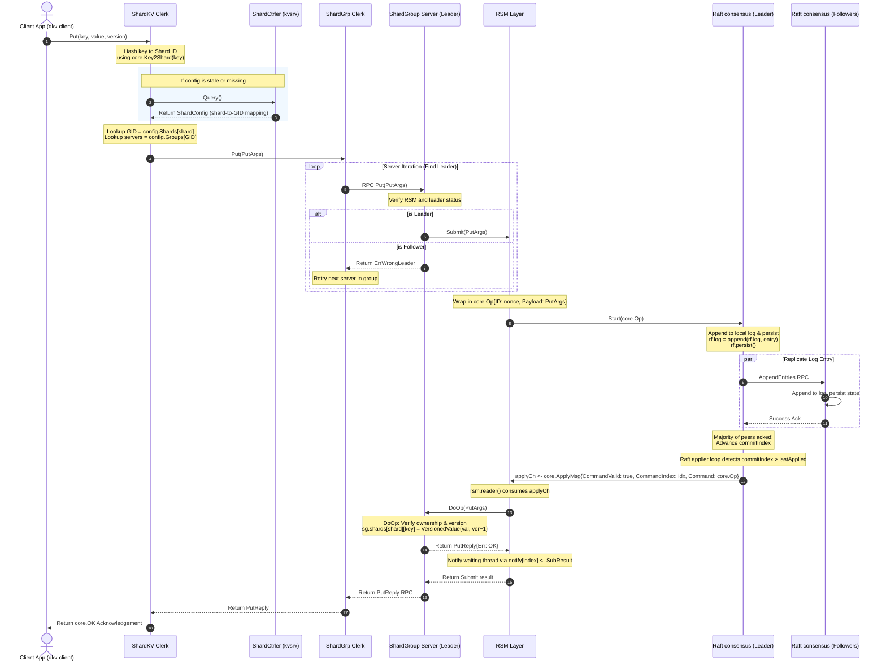

# Sharded Key-Value Store: Request Flow Walkthrough

This document traces the complete life-cycle of a client request (e.g., `Put(key, value, version)`) in the Distributed Key-Value Store codebase—from initiation at the client application to consensus log replication, state machine application, and back as an acknowledgement.

---

## Request Flow Diagram



---

## Step-by-Step Execution Details

### 1. Client App Request Initiation
The client application invokes either `Get` or `Put` via the command-line client or integration library.
* **File:** [cmd/dkv-client/main.go](../DistributedKeyValueStore/cmd/dkv-client/main.go#L72)
* **Docker Container:** Runs on the client side, typically outside of the server containers (e.g., host system or a generic client shell container).
* **Action:** Parses input command and calls `ck.Put(key, value, version)`.

### 2. Deterministic Key Partitioning (Key2Shard)
The client-side `shardkv.Clerk` maps the target key to a partition/shard.
* **File:** [internal/shardkv/client.go](../DistributedKeyValueStore/internal/shardkv/client.go#L65-L66)
* **Docker Container:** Runs on the client side (within the client process).
* **Action:**
  ```go
  shard := core.Key2Shard(key)
  ```
* **Hash function:** Maps keys to one of the 10 static shards based on the first character modulo `NShards` in [internal/core/shard.go](../DistributedKeyValueStore/internal/core/shard.go#L16-L23).

### 3. Shard Configuration Discovery
* **File:** [internal/shardkv/client.go](../DistributedKeyValueStore/internal/shardkv/client.go#L68-L80)
* **Docker Container:** Queries the `dkv-shardctrler` container (which in turn queries/persists configuration state in the `dkv-kvsrv` metadata store container).
* **Action:** The clerk determines which replica group (Group ID, or `GID`) owns the target shard via `ck.config.Shards[shard]`.
* **Note:** If the cached configuration indicates no group (`GID == 0`) or if a request fails later with `ErrWrongGroup` or `ErrFrozen`, the clerk queries the central `ShardController` (`ck.sc.Query()`) to refresh the configuration map and retry routing.

### 4. Routing to the Replica Group (Shard Group Clerk)
* **File:** [internal/shardkv/client.go](../DistributedKeyValueStore/internal/shardkv/client.go#L70-L74)
* **Docker Container:** Runs on the client side (within the client process).
* **Action:** The clerk instantiates/retrieves a `shardgrp.Clerk` targeting the list of servers registered for that `GID` and forwards the RPC request.

### 5. Reaching the Consensus Leader
* **File:** [internal/shardgrp/client.go](../DistributedKeyValueStore/internal/shardgrp/client.go#L35-L45)
* **Docker Container:** Targets the target Shard Group server containers (e.g., `dkv-kvraft-0`/`1`/`2` for GID 1; `dkv-shardgrp2-0`/`1`/`2` for GID 2).
* **Action:** `shardgrp.Clerk` iterates through the group's server addresses, sending the `Put` or `Get` RPC.
* **Consensus Check:** If a server is not the current Raft leader, it returns `ErrWrongLeader`. The client clerk catches this and proceeds to try the next server in the group.

### 6. Submission to the Replicated State Machine (RSM)
* **File:** [internal/shardgrp/server.go](../DistributedKeyValueStore/internal/shardgrp/server.go#L86-L103)
* **Docker Container:** Active Shard Group Leader container (e.g., `dkv-kvraft-X` or `dkv-shardgrp2-X` depending on which node is the current Leader).
* **Action:** The active group leader receives the RPC. It forwards the payload to its local RSM wrapper:
  ```go
  rep, err := r.Submit(*args)
  ```

### 7. RSM Wrapping & Propose to Raft Log
* **File:** [internal/rsm/rsm.go](../DistributedKeyValueStore/internal/rsm/rsm.go#L53-L72)
* **Docker Container:** Active Shard Group Leader container (e.g., `dkv-kvraft-X` or `dkv-shardgrp2-X`).
* **Action:**
  1. The RSM generates a unique 64-bit nonce/ID for the operation.
  2. Wraps the payload in `core.Op{ID: nonce, Payload: op}`.
  3. Proposes the operation to the consensus log by calling `r.rf.Start(opWrapper)`.
  4. Creates a temporary notification channel mapped by the returned log index (`r.notify[index]`).

### 8. Consensus Replication & Persistence
* **File:** [internal/raft/raft.go](../DistributedKeyValueStore/internal/raft/raft.go#L98-L116)
* **Docker Container:** Originates in the Shard Group Leader container and replicates to the Shard Group Follower containers (e.g., replication traffic flowing between containers `dkv-kvraft-0`/`1`/`2` or `dkv-shardgrp2-0`/`1`/`2`).
* **Action:**
  1. Raft checks if it is the leader. If so, it appends the `core.Op` entry to its local log.
  2. The leader persists its updated log to disk via `rf.persist()`.
  3. Triggers replication to all followers: `go rf.replicateToAll()`.
* **File:** [internal/raft/replication.go](../DistributedKeyValueStore/internal/raft/replication.go#L49-L73)
* **Action:** The leader constructs and sends `AppendEntries` RPCs containing the new entry to the followers. Follower nodes write the entries to their logs, persist the state, and reply with success.

### 9. Consensus Commitment
* **File:** [internal/raft/replication.go](../DistributedKeyValueStore/internal/raft/replication.go#L97-L118)
* **Docker Container:** Initiated on the Shard Group Leader container (e.g., `dkv-kvraft-X` or `dkv-shardgrp2-X`) once majority acknowledgement is received from the group's follower containers.
* **Action:** Once a majority of followers have acknowledged the entry, the leader advances its internal `commitIndex`. It broadcasts a signal to its background `applier` goroutine via `rf.applyCond.Broadcast()`.

### 10. RSM Application Loop (Consensus to State Machine)
* **File:** [internal/raft/replication.go](../DistributedKeyValueStore/internal/raft/replication.go#L225-L271)
* **Docker Container:** Runs on all active Shard Group server containers (both Leader and Followers as they each apply the committed entry to their respective state machines).
* **Action:** The `applier()` goroutine detects the commit, constructs a `core.ApplyMsg{CommandValid: true, CommandIndex: idx, Command: entry.Command}`, and pushes it to the `applyCh`.
* **File:** [internal/rsm/rsm.go](../DistributedKeyValueStore/internal/rsm/rsm.go#L98-L126)
* **Action:**
  1. The `rsm.reader()` goroutine reads the committed message from `applyCh`.
  2. Applies it to the underlying state machine: `rep := r.sm.DoOp(op.Payload)`.
  3. Notifies the waiting thread (if it is the leader node) by sending the result on `r.notify[CommandIndex]`.

### 11. Core State Modification (DoOp)
* **File:** [internal/shardgrp/server.go](../DistributedKeyValueStore/internal/shardgrp/server.go#L169-L243)
* **Docker Container:** Runs locally within each Shard Group container (both Leader and Followers execute this modification locally to keep state machines in sync).
* **Action:** `DoOp` runs under the `ShardGroup` mutex.
  1. Checks if the group still owns the shard. If not, returns `ErrWrongGroup`.
  2. Checks if the shard is migrating (`sg.frozen[shard]`). If so, returns `ErrFrozen`.
  3. Verifies versions to ensure linearizable / at-most-once execution:
     * If `version == 0` (create new key), ensures key does not exist; writes value with version 1.
     * If `version > 0`, ensures key exists and version matches; updates value and increments version.
     * Otherwise, returns `ErrVersion`.

### 12. Returning Acknowledgement to Client
* **File:** [internal/rsm/rsm.go](../DistributedKeyValueStore/internal/rsm/rsm.go#L82-L95)
* **Docker Container:** Returns from the active Shard Group Leader container (e.g., `dkv-kvraft-X` or `dkv-shardgrp2-X`) back to the client application (outside the server containers).
* **Action:** The waiting `RSM.Submit()` call receives the `SubResult` from the channel, checks that the unique operation ID matches (confirming leadership wasn't lost), and returns the `core.PutReply` / `core.GetReply`.
* **Unwinding Call Stack:**
  1. `ShardGroup.Put()` receives the reply and finishes responding to the gRPC RPC.
  2. `shardgrp.Clerk` returns the RPC result.
  3. `shardkv.Clerk` returns the final status to the client application.
  4. The client CLI prints `OK` (or prints the retrieved value/version for `Get`).
