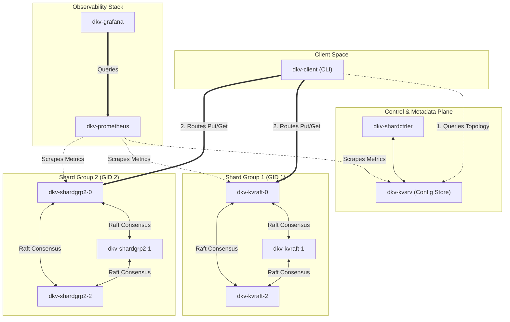

# Distributed Key-Value Store (DKV)

A production-grade, distributed, sharded, and fault-tolerant key-value store based on Raft consensus and replicated state machines.

---

## Quickstart

### 1. Start the Cluster
Run the automation script from the repository root to compile the client binary and boot up the 10-node Docker cluster (including observability stack):

```bash
./deploy.sh
```

---

## Interacting with the Store (Client CLI)

Because the replica nodes register using internal Docker hostnames (`dkv-kvraft-0:8000`), the client CLI must run within the Docker bridge network (`docker_kvnet`) to resolve hostnames and route requests correctly.

Depending on your current working directory, run the client as follows:

### Option A: From the Repository Root (Recommended)
If you are at the root directory of the repository, run:
```bash
# Write a key-value pair
docker run --rm --network docker_kvnet -v "$PWD"/DistributedKeyValueStore/bin/dkv-client:/usr/local/bin/dkv-client alpine:3.20 dkv-client --ctrler-addr kvsrv:9000 put mykey myvalue

# Read a key-value pair
docker run --rm --network docker_kvnet -v "$PWD"/DistributedKeyValueStore/bin/dkv-client:/usr/local/bin/dkv-client alpine:3.20 dkv-client --ctrler-addr kvsrv:9000 get mykey
```

### Option B: From the `DistributedKeyValueStore` Folder
If you have navigated into the Go module subdirectory (`cd DistributedKeyValueStore`), run:
```bash
# Write a key-value pair
docker run --rm --network docker_kvnet -v "$PWD"/bin/dkv-client:/usr/local/bin/dkv-client alpine:3.20 dkv-client --ctrler-addr kvsrv:9000 put mykey myvalue

# Read a key-value pair
docker run --rm --network docker_kvnet -v "$PWD"/bin/dkv-client:/usr/local/bin/dkv-client alpine:3.20 dkv-client --ctrler-addr kvsrv:9000 get mykey
```

---

## Observability & Monitoring

Once deployed, the following dashboards and endpoints are exposed locally:

*   **Grafana Dashboards**: [http://localhost:3003](http://localhost:3003) (Login: `admin` / `admin`)
*   **Prometheus Metrics**: [http://localhost:9090](http://localhost:9090)
*   **Shard Controller Endpoint**: `localhost:9100`
*   **Configuration Metadata Store (kvsrv)**: `localhost:9000`

---

## System Topology & Wire Diagram

The following diagram represents the network connectivity and interactions between the components of the DKV cluster:


